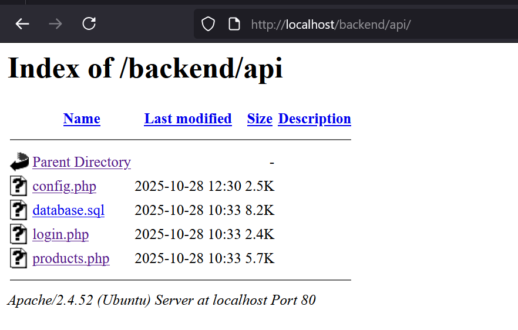

  ## Importar la base de datos a MariaDB:
  /src/api/database.sql
  El script incluye `CREATE DATABASE ferreteria_db` y las tablas necesarias. Puedes ejecutarlo desde cualquier ubicación indicando la ruta completa o situándote en el directorio `api/`.
  ```Bash
  mysql -u root -p < database.sql
  ```
  ## Configuración de credenciales:
  Dentro de config.php adaptar credenciales a las que uses en tu sistema local:
  ```php
  define('DB_HOST', 'localhost');        // Generalmente 'localhost' o '127.0.0.1'
  define('DB_USER', 'root');             // Usuario de tu MySQL (por defecto 'root' en XAMPP)
  define('DB_PASS', '123');                 // Contraseña de MySQL (vacío por defecto en XAMPP)
  define('DB_NAME', 'ferreteria_db');
  ```
  Para asegurarte de que funciona, prueba los endpoints. Ejemplo:
  ```bash
  curl -X POST http://localhost/backend/api/login.php \
  -H "Content-Type: application/json" \
  -d '{"username":"administrador","password":"admin123"}'
  ```
  ## Endpoints
  Base URL: `http://localhost/backend/api/`

  - `login.php`
    - `POST`: recibe `{ "username": "...", "password": "..." }`, devuelve token e info básica del usuario si las credenciales son válidas.
      ```bash
      curl -X POST http://localhost/backend/api/login.php \
        -H "Content-Type: application/json" \
        -d '{"username":"administrador","password":"admin123"}'
      ```

  - `products.php`
    - `GET`: lista productos activos; acepta filtros opcionales `category`, `search` y `lowStock`.
      ```bash
      curl "http://localhost/backend/api/products.php?category=Herramientas&search=martillo"
      ```
    - `POST`: crea un producto nuevo con campos como `code`, `name`, `category`, `price`, `stock`.
      ```bash
      curl -X POST http://localhost/backend/api/products.php \
        -H "Content-Type: application/json" \
        -d '{"code":"ABC123","name":"Martillo demo","category":"Herramientas","price":199.99,"stock":20}'
      ```
    - `PUT`: actualiza un producto existente identificándolo por `id` y permite editar datos generales y stock.
      ```bash
      curl -X PUT http://localhost/backend/api/products.php \
        -H "Content-Type: application/json" \
        -d '{"id":5,"name":"Martillo reforzado","category":"Herramientas","price":220,"stock":18}'
      ```
    - `DELETE`: aplica baja lógica (`active = 0`) recibiendo `id` en el cuerpo.
      ```bash
      curl -X DELETE http://localhost/backend/api/products.php \
        -H "Content-Type: application/json" \
        -d '{"id":5}'
      ```
  ## Dependencias del proyecto
  - Linux (Ubuntu/Debian): instala `apache2`, `libapache2-mod-php`, `php`, `php-mysql`.
  - Windows: XAMPP ya trae Apache, PHP y MySQL listos, no es necesario habilitar módulos adicionales más allá de iniciar ambos servicios.

  ## Correr:
  Una vez listo, correr agregando proyecto a /var/www/html
  ```Bash
  sudo systemctl start apache2  
  ```
  En este caso la api esta en localhost/backend/api porque en var/www/html/**backend**. Por lo tanto, mi API esta en 
  http://localhost/backend/api/Ejemplo-endpoint.php
  

  ## XAMPP (Windows)
  - Descarga XAMPP desde https://www.apachefriends.org e instálalo (ruta sugerida `C:\xampp`).
  - Abre el *XAMPP Control Panel* y pulsa *Start* en **Apache** y **MySQL**.
  - Copia este proyecto a `C:\xampp\htdocs\backend\api` manteniendo la estructura `backend/api/*.php`.
  - Entra a http://localhost/phpmyadmin, crea la base `ferreteria_db` (si no existe) y usa *Importar* para cargar `api/database.sql`.
  - Ajusta `api/config.php` si usas credenciales distintas (por defecto XAMPP usa usuario `root`, contraseña vacía).
  - Accede a la API en http://localhost/backend/api/ y prueba con los comandos `curl` documentados arriba o desde tu frontend. Incluso en PostMan
  - XAMPP ya incluye PHP y la extensión `mysqli` activa; solo revisa `php.ini` si la deshabilitaste. Consulta `C:\xampp\apache\logs\error.log` ante cualquier fallo.
